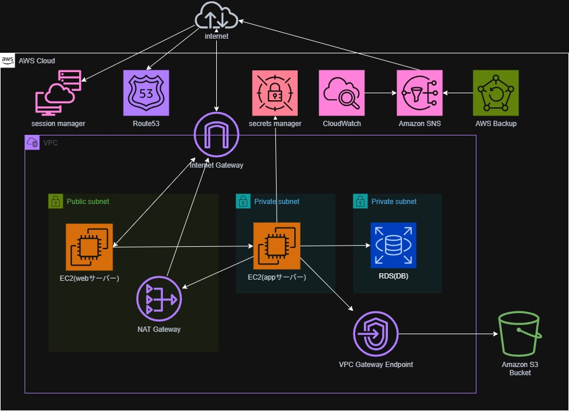

**「Node.jsで動くアプリケーション本体」と、その手前でリクエストを受け付ける「Nginxリバースプロキシ」を、それぞれのサーバーに自動で構築・設定する**ためのコードです。

SSHポート（22番）を閉じたまま、AWS Systems Manager (SSM) Session Manager経由でAnsibleを実行することを想定しています。



---

## 1. Node.jsアプリサーバーの構築 (`hosts: app`)

プライベートサブネットにある `app` サーバーに対して、以下の処理を行います。

* **共通環境のセットアップ (`common_setup`):** OSのアップデートや、PythonからMySQLを操作するためのライブラリなど、システム全体で必要なツールをインストールします。
* **アプリのデプロイ (`nodejs_app`):** Node.js本体のインストール、ソースコードの配置、`npm install` による依存パッケージの導入、そして `systemd`（サービス管理ツール）への登録を行います。
* **自動再起動 (`handlers`):** アプリの設定ファイルやコードが更新されたときだけ、自動的に `nodeapp` サービスを再起動して変更を反映させます。

---

## 2. Nginxプロキシサーバーの構築 (`hosts: web`)

パブリックサブネットにある `web` サーバーに対して、以下の処理を行います。

* **Nginxの設定 (`nginx_proxy`):** Nginxをインストールし、外部（インターネット）からのアクセスを `app` サーバーに転送するための「リバースプロキシ」設定を作成します。

---

## 全体の動作イメージ

1. **ブラウザからのアクセス:** ユーザーが `web` サーバーのIPにアクセスします。
2. **Nginxが中継:** `web` サーバー上のNginxが、そのリクエストをプライベートサブネットにある `app` サーバーのNode.jsアプリへ転送します。
3. **アプリが応答:** Node.jsアプリが処理を行い、結果をNginx経由でユーザーに返します。

## セットアップ手順

### 1. 前提条件

* ローカルPCに **Ansible**, **AWS CLI**, **Session Manager Plugin** がインストールされていること。
* EC2インスタンスに `AmazonSSMManagedInstanceCore` 権限を持つIAMロールが付与されていること。

### 2. インベントリの準備

`inventory.ini.example` を `inventory.ini` にコピーし、お使いの環境に合わせてインスタンスIDを記入してください。

```bash
cp inventory.ini.example inventory.ini
# inventory.ini 内の i-xxxxxxxx を実際のIDに書き換える
```

### 3. 変数の設定

`group_vars/all.yml`（または各ロールの `vars/main.yml`）にて、RDSのホスト名やS3バケット名を設定します。

### 4. プレイブックの実行

```bash
ansible-playbook -i inventory.ini site.yml
```

### まとめ

このコードを実行するだけで、「セキュリティのためにアプリ本体は隠しつつ、Nginxを窓口にして公開する」というWebシステムの標準的なインフラ構成が自動的に完成するようになっています。


### インストールパッケージ一覧

| サーバー | カテゴリ | パッケージ名 / ツール名 | 用途 |
| --- | --- | --- | --- |
| **Webサーバー** (`web`) | **Webサーバー** | `nginx` | リバースプロキシとして動作し、リクエストを転送する |
|  | **ユーティリティ** | `curl`, `git`, `tar` | インストールやコード取得に使用 |
| **Appサーバー** (`app`) | **言語・実行環境** | `nvm` (Node Version Manager) | Node.jsのバージョン管理 |
|  |  | `Node.js (LTS)` | アプリケーションの実行本体 |
|  | **Node.jsライブラリ** | `express` | Webアプリケーションフレームワーク |
|  |  | `mysql2` | RDS（MySQL/MariaDB）への接続用 |
|  |  | `aws-sdk` | S3などのAWSリソース操作用 |
|  | **DBクライアント** | `mariadb105` (client) | サーバーからDBへの接続確認用 |
|  | **ビルド・依存関係** | `gcc`, `make`, `openssl-devel` | ネイティブモジュールのビルド用 |
|  |  | `python3-pip`, `PyMySQL` | AnsibleからMySQLを操作するための連携用 |
|  |  | `libffi-devel`, `bzip2` | システムの共通依存関係 |
